# 🚀 AI Research Explorer


An AI-powered platform for exploring, analyzing, and understanding research papers using Retrieval-Augmented Generation (RAG), Large Language Models (LLMs), and modern full-stack development technologies.

## 🎯 Highlights

- Full Stack AI Application
- Retrieval-Augmented Generation (RAG)
- JWT Authentication
- Research Paper Analysis
- LangChain Integration
- PostgreSQL Database
- FastAPI Backend
- React Frontend


---

# 📖 Overview

AI Research Explorer helps students, researchers, and developers interact with research papers through Artificial Intelligence.

### Users can:

- Upload research papers in PDF format
- Ask questions from uploaded papers
- Generate summaries
- Explore research topics
- Generate literature reviews
- Discover research gaps
- Compare research papers
- Maintain a personal research library

The project combines FastAPI, PostgreSQL, React, JWT Authentication, and RAG-based document retrieval into a single platform.

---

# ✨ Features

## 🔐 Authentication

- User Registration
- User Login
- JWT Authentication
- Protected Routes
- Password Hashing
- Logout Functionality

---

## 📄 Research Paper Management

- Upload PDF Research Papers
- Store User Documents
- View Uploaded Papers
- Activity Tracking
- User-Specific Libraries

---

## 🤖 AI Features

### Research Assistant

Ask questions from uploaded papers using Retrieval-Augmented Generation.

### Paper Summarization

Generate concise summaries of research papers.

### Topic Explorer

Explore research domains and understand concepts.

### Literature Review Generator

Automatically generate literature reviews from uploaded papers.

### Research Gap Finder

Discover unexplored opportunities in research.

### Compare Papers

Compare two research papers and analyze differences.

---

# 🏗 System Architecture

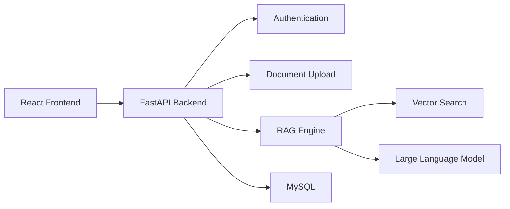

---

# 🧠 Retrieval-Augmented Generation Workflow

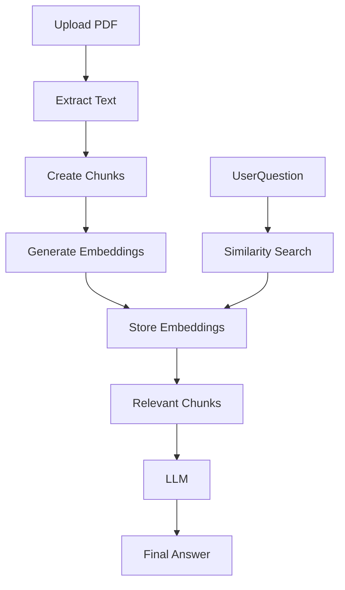

---

# 🔧 Backend Architecture

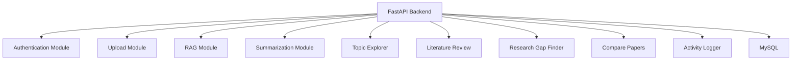

---

# 🗄 Database Schema

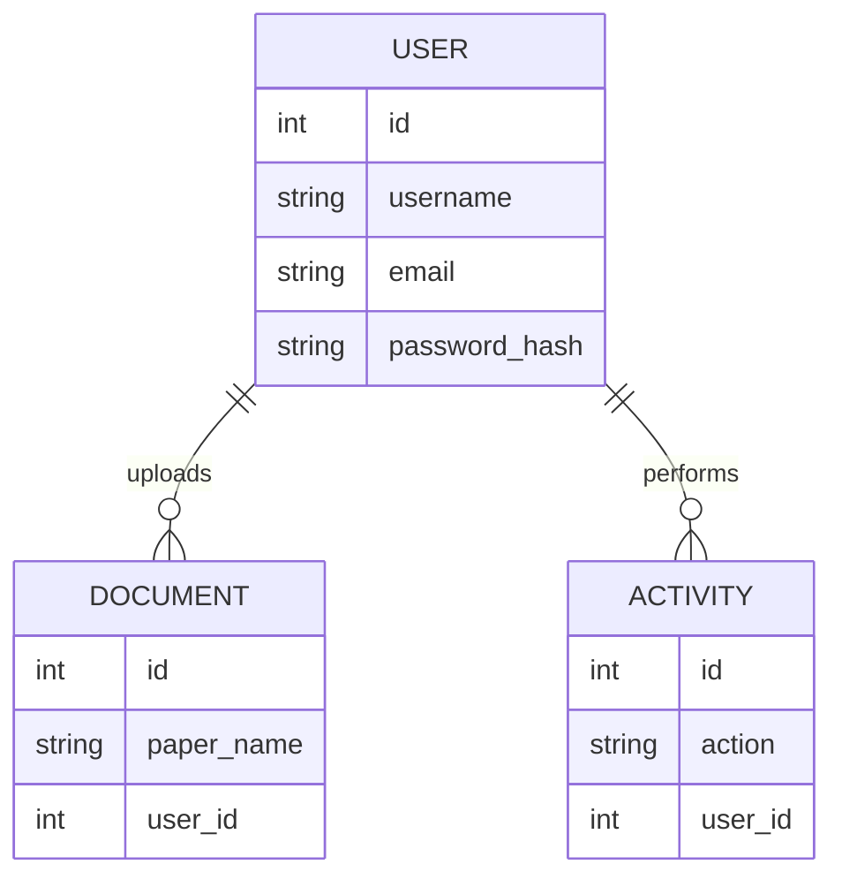

---

# 📂 Project Structure

```text
AI-Research-Explorer/

├── frontend/
│
│   ├── public/
│   │
│   ├── src/
│   │
│   │   ├── components/
│   │   │
│   │   │   ├── DashboardCards.jsx
│   │   │   ├── Navbar.jsx
│   │   │   ├── ProtectedRoute.jsx
│   │   │   ├── RecentActivity.jsx
│   │   │   ├── RecentDocuments.jsx
│   │   │   └── Sidebar.jsx
│   │   │
│   │   ├── pages/
│   │   │
│   │   │   ├── LandingPage.jsx
│   │   │   ├── Login.jsx
│   │   │   ├── Signup.jsx
│   │   │   ├── Dashboard.jsx
│   │   │   ├── Upload.jsx
│   │   │   ├── Documents.jsx
│   │   │   ├── Activity.jsx
│   │   │   ├── Query.jsx
│   │   │   ├── Summarize.jsx
│   │   │   ├── TopicExplorer.jsx
│   │   │   ├── LiteratureReview.jsx
│   │   │   ├── ResearchGap.jsx
│   │   │   └── ComparePaper.jsx
│   │   │
│   │   ├── services/
│   │   │   └── api.js
│   │   │
│   │   ├── App.jsx
│   │   └── main.jsx
│
├── backend/
│
│   ├── src/
│   │
│   │   ├── api/
│   │   │   └── main.py
│   │   │
│   │   ├── database/
│   │   │
│   │   │   ├── database.py
│   │   │   ├── models.py
│   │   │   └── schemas.py
│   │   │
│   │   ├── features/
│   │   │
│   │   │   ├── rag.py
│   │   │   ├── summarize_paper.py
│   │   │   ├── topic_explorer.py
│   │   │   ├── literature_review.py
│   │   │   ├── research_gap.py
│   │   │   └── compare_papers.py
│   │   │
│   │   ├── utils/
│   │   │
│   │   │   ├── auth.py
│   │   │   ├── security.py
│   │   │   ├── dependencies.py
│   │   │   ├── activity.py
│   │   │   └── upload_pdf.py
│
└── README.md
```

---

# 🖥 Frontend Pages

| Page | Purpose |
|--------|----------|
| Landing Page | Project Introduction |
| Login | User Authentication |
| Signup | User Registration |
| Dashboard | Project Overview |
| Upload | Upload PDF Papers |
| Documents | View Uploaded Papers |
| Activity | View User Activities |
| Query | Ask Questions |
| Summarize | Generate Summaries |
| Topic Explorer | Research Topic Exploration |
| Literature Review | Generate Literature Reviews |
| Research Gap | Discover Research Gaps |
| Compare Papers | Compare Research Papers |

---

# 📡 API Endpoints

## Authentication

| Method | Endpoint |
|----------|----------|
| POST | /signup |
| POST | /login |

---

## Document Management

| Method | Endpoint |
|----------|----------|
| POST | /upload |
| GET | /my-documents |
| GET | /activity |

---

## AI Features

| Method | Endpoint |
|----------|----------|
| POST | /query |
| POST | /summarize |
| POST | /topic |
| POST | /literature-review |
| POST | /research-gap |
| POST | /compare |

---

# 🔧 Tech Stack

## Frontend

- React.js
- React Router DOM
- Axios
- JavaScript
- Vite

## Backend

- FastAPI
- SQLAlchemy
- JWT Authentication
- Uvicorn

## Database

- MySQL

## AI & NLP

- LangChain
- Retrieval-Augmented Generation (RAG)
- Embeddings
- Semantic Search
- Large Language Models (LLMs)

---

# 📸 Screenshots

## 🏠 Landing Page

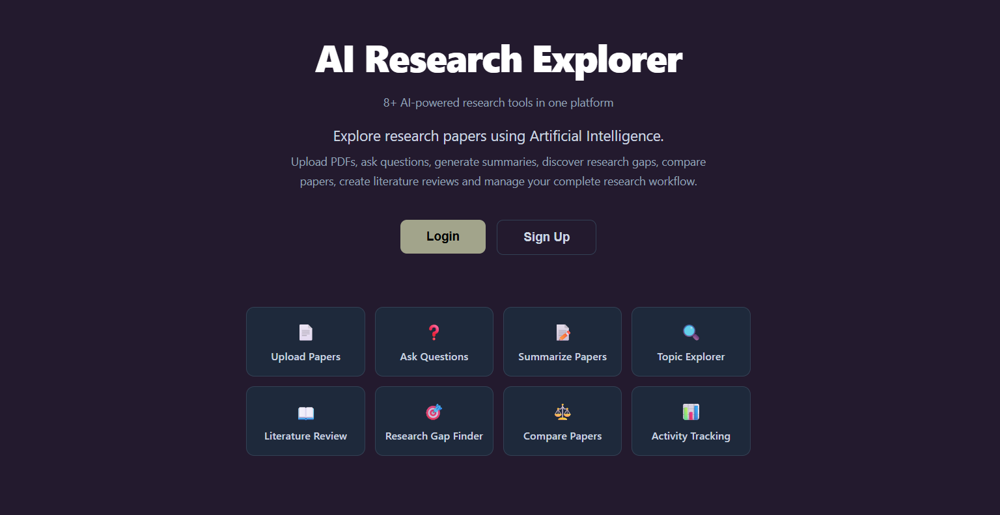

The landing page introduces the platform and provides navigation to Login and Signup pages.

---

## 🔐 Login Page

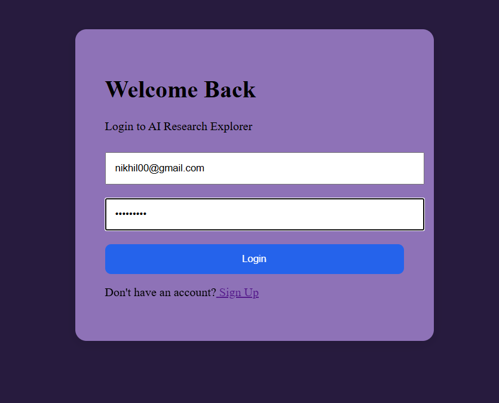

Secure user authentication using JWT-based login.

---

## 📝 Signup Page

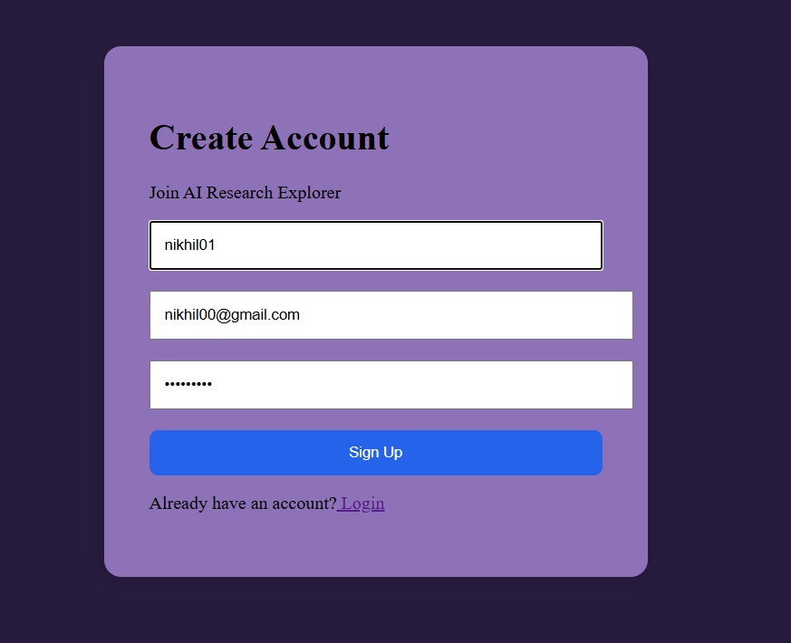

New users can create an account and access personalized research libraries.

---

## 📊 Dashboard

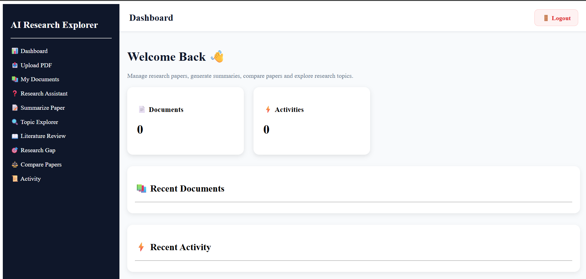

Central workspace showing document statistics, recent activities, and quick navigation to AI features.

---

## 📄 Upload Research Paper

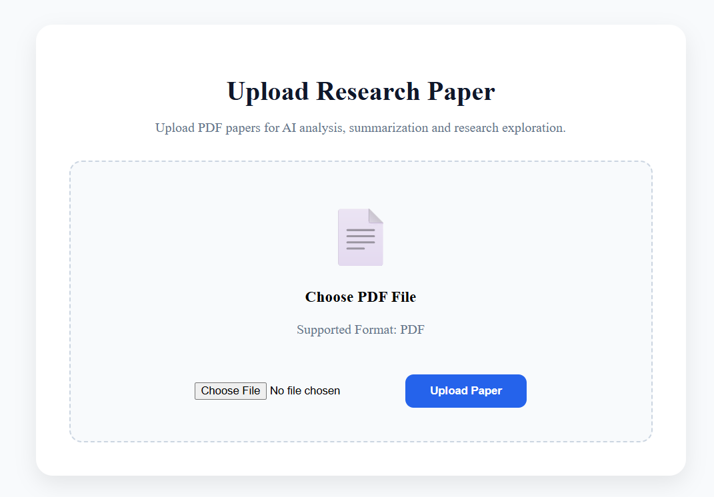

Upload PDF research papers for AI-powered analysis and retrieval.

---

## ❓ Research Assistant

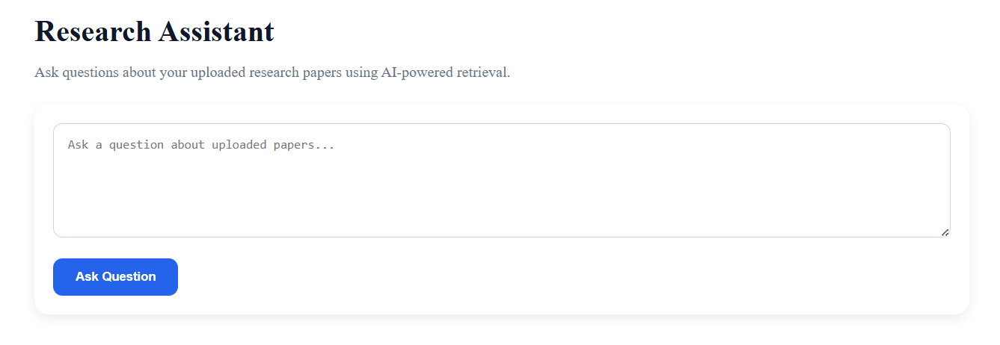

Ask questions directly from uploaded research papers using Retrieval-Augmented Generation (RAG).

---

## 📑 Paper Summarization

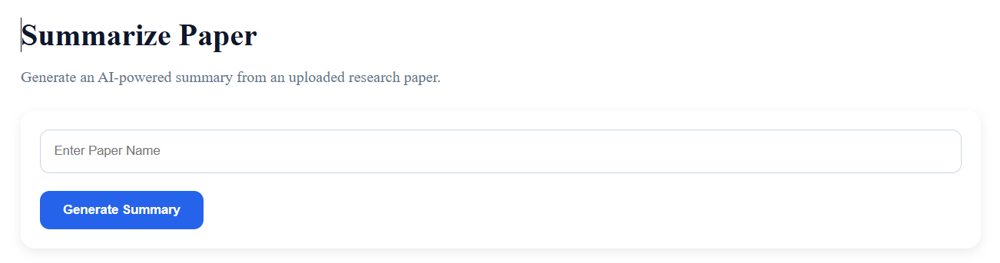

Generate concise summaries from uploaded research papers.

---

## 🔍 Topic Explorer

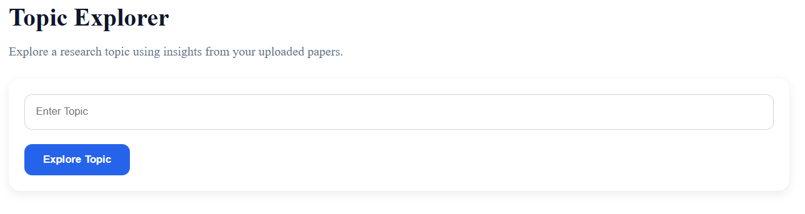

Explore research topics and receive AI-generated explanations.

---

## 🎯 Research Gap Finder

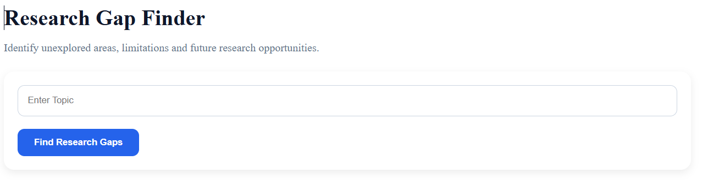

Identify potential research opportunities and unexplored areas.

---

## ⚖️ Paper Comparison

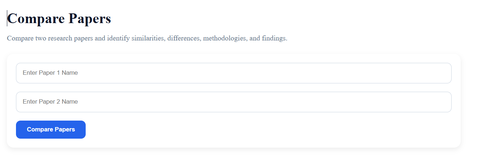

Compare two research papers and analyze their similarities and differences.

---

# 🚀 Installation

## Clone Repository

```bash
git clone https://github.com/yourusername/AI-Research-Explorer.git
```

---

## Frontend Setup

```bash
cd frontend

npm install

npm run dev
```

Frontend runs on:

```text
http://localhost:5173
```

---

## Backend Setup

```bash
cd backend

pip install -r requirements.txt

uvicorn src.api.main:app --reload
```

Backend runs on:

```text
http://localhost:8000
```

---

# 🎯 Learning Outcomes

This project demonstrates:

- Full Stack Development
- React Development
- FastAPI Development
- PostgreSQL Integration
- JWT Authentication
- Retrieval-Augmented Generation
- LangChain Integration
- Document Processing
- Semantic Search
- AI Application Development

---

# 🔮 Future Improvements

- Multi-document Chat
- Citation Generation
- PDF Viewer
- Research Recommendation System
- Research Trend Analysis
- Fine-Tuned Domain-Specific Research LLM for improved paper understanding and question answering.
- Cloud Storage Integration
- User Profiles
- Vector Database Integration (Pinecone/Chroma)

---

# 📄 Resume Description

Built an AI-powered Research Assistant using React, FastAPI, PostgreSQL, LangChain, and Retrieval-Augmented Generation (RAG). Implemented PDF ingestion, semantic search, research paper summarization, literature review generation, topic exploration, research gap identification, paper comparison, JWT authentication, and activity tracking in a full-stack production-style application.

---

# 🌐 Deployment( If I use Gemini Api In The Place Of Ollama Which Runs Locally)

Frontend: Vercel

Backend: Render

Database: PostgreSQL(In The Place Of Mysql)

Future deployment links:

Frontend URL: Coming Soon

Backend URL: Coming Soon


# 👨‍💻 Author

**Nikhil Mishra**

B.E. Student | AI/ML Enthusiast | Full Stack Developer

